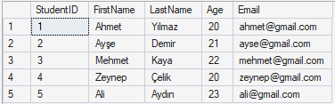
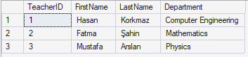
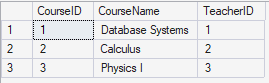
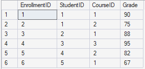

# 🎓 Student Management System (SQL Server)

A beginner-level SQL Server project developed using SQL Server Management Studio (SSMS). This project demonstrates the fundamentals of relational database design and SQL querying.

## 📌 Project Features

- Create and manage a SQL Server database
- Design relational database tables
- Define primary key and foreign key relationships
- Insert sample data
- Perform basic and intermediate SQL queries
- Use JOIN, GROUP BY, ORDER BY, WHERE, and aggregate functions

## 🛠 Technologies

- Microsoft SQL Server 2022 Express
- SQL Server Management Studio (SSMS)

## 🗂 Database Structure

The project includes the following tables:

- Students
- Teachers
- Courses
- Enrollments

## 📖 SQL Topics Covered

- CREATE DATABASE
- CREATE TABLE
- PRIMARY KEY
- FOREIGN KEY
- INSERT INTO
- SELECT
- WHERE
- ORDER BY
- INNER JOIN
- GROUP BY
- HAVING
- COUNT()
- AVG()
- MIN()
- MAX()

## ▶️ How to Run

1. Open SQL Server Management Studio (SSMS).
2. Execute `01_Create_Database.sql`.
3. Execute `02_Create_Tables.sql`.
4. Execute `03_Insert_Data.sql`.
5. Execute `04_Queries.sql`.

## 📷 Screenshots

### Students Table

### Teachers Table

### Courses Table

### Enrollments Table

## 👨‍💻 Author

Developed by **Himmet Şepik**
